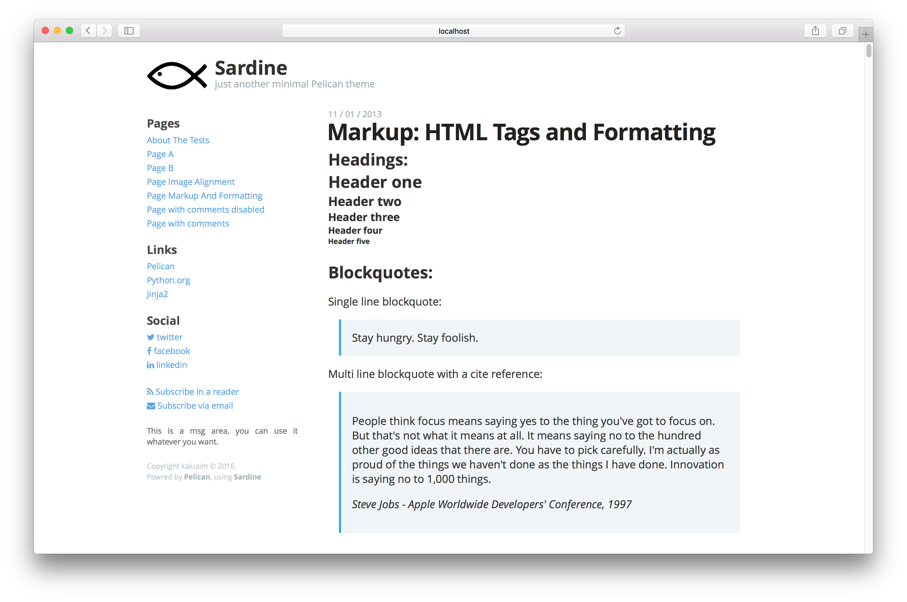

Sardine
#######

A minimal `Pelican <http://blog.getpelican.com/>`__ theme.

Screenshot
===========

Features
========

+ Responsive.
+ RTL support.
+ Easy to customize (title, subtitle, side menu, ...).

Demo
====

`LTR Demo <http://kalua.im/sardine/>`__

`RTL Demo (my personal website) <http://kalua.im/blog/>`__

Install
=======

Clone the repository then edit the ``THEME`` identifier in ``pelicanconf.py`` to point to the downloaded theme location, example: ``THEME = '/Users/kaluaim/workspace/sardine/theme'``

Configurations
==============

Sardine has its own custom identifiers in ``pelicanconf.py`` for easy customization:

+ ``SRDN_SITE_DIRECTION`` if ``'rtl'`` then will import ``rtl.css`` to the site
+ ``SRDN_SITE_LOGO`` the name of the site logo inside the ``static/images`` folder, for example: ``'sardine.png'``.
+ ``SRDN_TAGLINE`` tagline under the site name.
+ ``SRDN_SIDE_TITLE_PAGES`` ``SRDN_SIDE_TITLE_PAGES`` ``SRDN_SIDE_TITLE_PAGES`` ``SRDN_SIDE_TITLE_PAGES`` titles for each section in the side menu.
+ ``SRDN_SIDE_MSG`` text area above the footer.
+ ``SRDN_RSS_TITLE`` ``SRDN_RSS_URL`` feet title and URL in the side menu.
+ ``SRDN_EMAIL_TITLE`` ``SRDN_EMAIL_URL`` eamil subscription title and URL.
+ ``SRDN_CATEGORY_TEXT`` ``SRDN_TAG_TEXT`` the way you want the category and the tag to apper at the end of post, for example: ``'Category:'`` and ``'Tag:'``.
+ ``SRDN_DISQUS_SITENAME`` the site name for Disqus.
+ ``SRDN_COMMENTS_DISABLED_MSG`` text shown if the comments was disabled in a post. you can disable the commient by adding this metadata ``:comment: false``
+ ``SRDN_FOOTER_LINES`` tuple conteaning HTML footer lines, after each line `` `` will be added. example: ``(('Copyright kaluaim © 2016'),('Powred by <a href="http://blog.getpelican.com/">Pelican</a>'),)``

In addition the theme uses the defaults pelican's identifiers like ``LINKS`` and ``SOCIAL``

Credit
======

Theme structure was influenced by `pelican-svbhack <https://github.com/gfidente/pelican-svbhack/>`__
and style by `Coding Horror <https://blog.codinghorror.com//>`__

Author
======

`@kaluaim <http://kalua.im/>`__

License
=======
Sardine is licensed under the MIT License.
